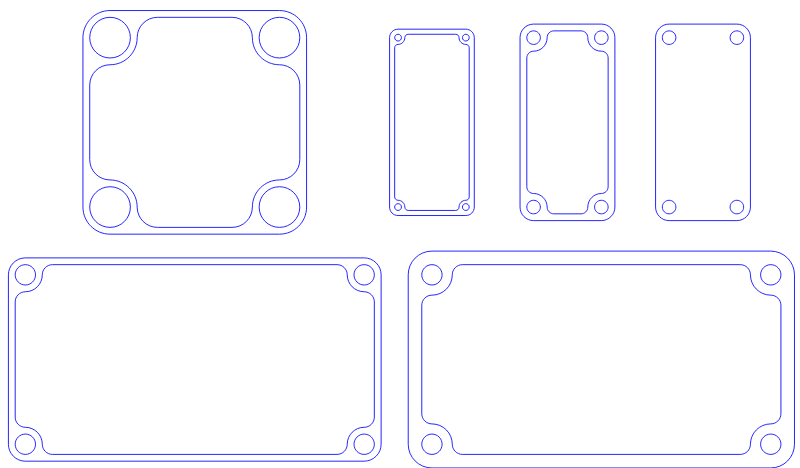

# Rimbox for Maker.js

A drawing of a parametric box with round corners and a bolt hole in each corner. 
The box may have an empty center which follows the contour of the holes and the sides, forming a rim.
If several of these are made of thin material they may be stacked to form an enclosure which can be secured with bolts.

[click here for a demo](http://microsoft.github.io/maker.js/demos/demo.html?demo=rimbox)

